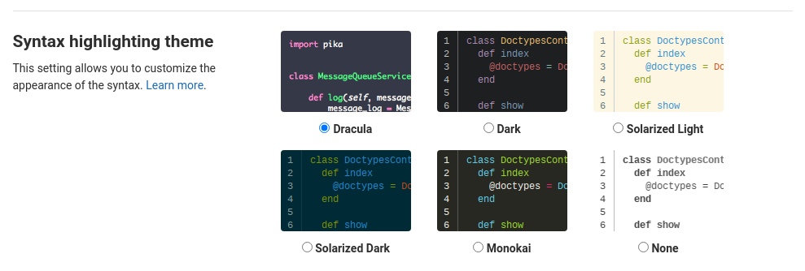

### [GitLab](http://gitlab.com/explore)

Currently this theme will only update the syntax highlighting for code and diffs.

#### Install with browser extension

-   Install Stylus for [Chrome](https://chrome.google.com/webstore/detail/stylus/clngdbkpkpeebahjckkjfobafhncgmne), [Firefox](https://addons.mozilla.org/en-US/firefox/addon/styl-us/) or [Opera](https://addons.opera.com/en-gb/extensions/details/stylus/)

-   [Click here to install Dracula for GitLab](https://github.com/dracula/gitlab/blob/master/dracula.user.css)

-   Once installed, it will replace the default syntax highlighting theme with Dracula here: https://gitlab.com/profile/preferences
    

#### Install manually

You can find a link to the css that you'll need to manually inject here:

https://github.com/dracula/gitlab/blob/master/dracula.css

#### Compile manually

Make sure Node.js is installed.

```sh
git clone https://github.com/dracula/gitlab dracula-gitlab
cd dracula-gitlab

cd build
npm install
npm run build
```

Then you'll find `dracula.css` and `dracula.user.css` in the root folder.