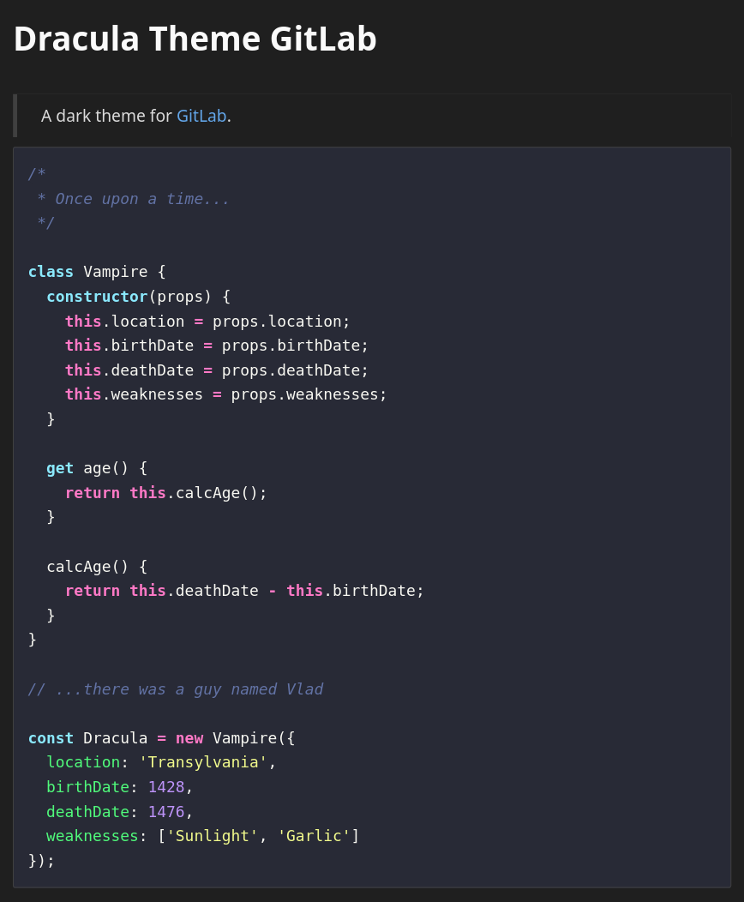

# Dracula for [GitLab](https://gitlab.com/explore)

> A dark theme for [GitLab](https://gitlab.com/explore).

## Install

All instructions can be found at [draculatheme.com/gitlab](https://draculatheme.com/gitlab).

## Team

This theme is maintained by the following person(s) and a bunch of [awesome contributors](https://github.com/dracula/template/graphs/contributors).

|  |
| --- |
| [Maki](https://github.com/makitsune) |

## License

[MIT License](./LICENSE)